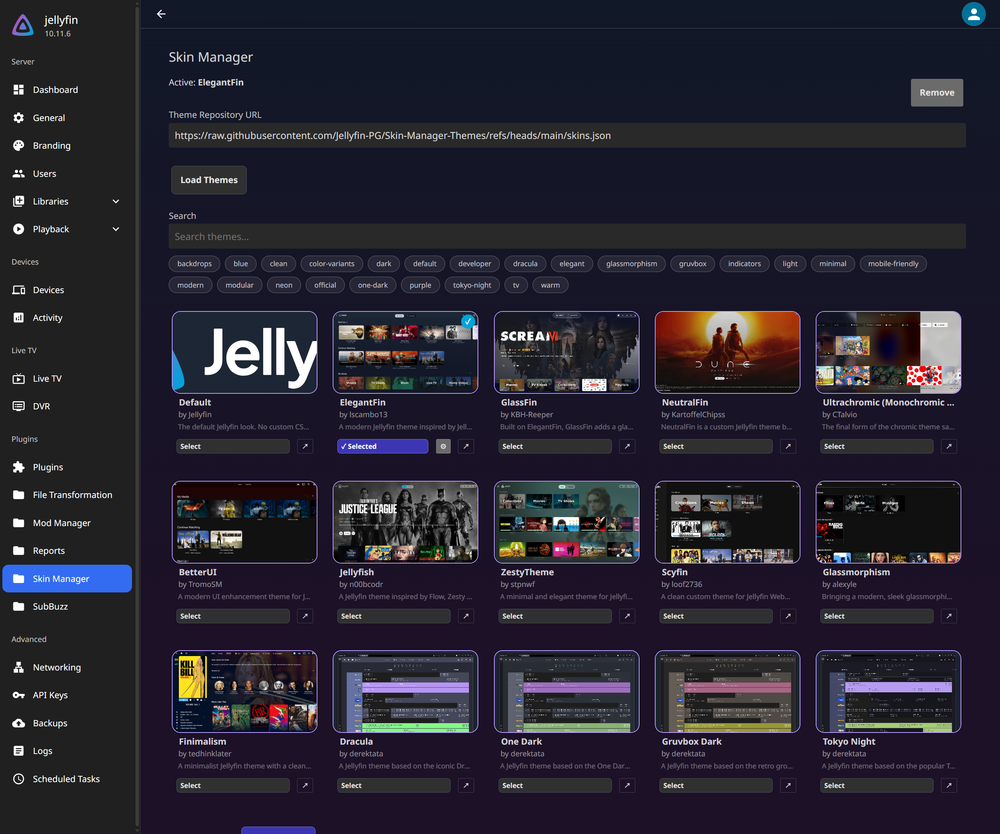
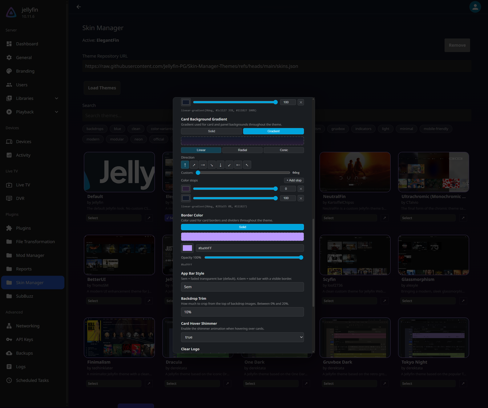

<div align="center">
  
  <h1>Skin Manager</h1>
  <p>A Jellyfin plugin that lets you browse and apply community CSS themes from the server dashboard. Themes are injected at request time, your Jellyfin install is never modified on disk.</p>
</div>

## Screenshots

<p align="center">
  <a href="assets/screenshot01.png">
    
  </a>
   
  <a href="assets/screenshot02.png">
    
  </a>
</p>
<p align="center">
  <em>Click on an image to view it full size.</em>
</p>

## Requirements

* Jellyfin 10.11+
* [File Transformation](https://github.com/IAmParadox27/jellyfin-plugin-file-transformation) plugin

Both plugins are available from the repository below.

## Installation

**1. Add the plugin repository**

In Jellyfin, go to **Dashboard > Plugins > Repositories** and add:

```
https://raw.githubusercontent.com/Jellyfin-PG/Repository/refs/heads/main/manifest.json
```

**2. Install the plugins**

Go to the **Catalogue** tab. Install **File Transformation** first, then **Skin Manager**. Restart Jellyfin after each install, or restart once after both.

**3. Open the theme store**

Navigate to **Dashboard > Skin Manager** in the sidebar. The default theme list loads automatically. Select a theme and click **Save & Apply**, then hard-refresh your browser (`Ctrl+Shift+R`).

## Theme Variables

As of version 1.2, themes can expose configurable variables that users can adjust without editing any CSS. When a theme supports variables, a **⚙** button appears next to the Select button on its card. Clicking it opens a popup where you can set values such as accent colors, font sizes, or toggle options. Changes take effect after clicking **Save & Apply**.

Theme authors declare variables in `skins.json` using a `vars` array. Each variable maps to a CSS custom property in the theme stylesheet, `ACCENT_COLOR` becomes `var(--accent-color)`, `FONT_SIZE` becomes `var(--font-size)`, and so on. See the [theme repository](https://github.com/Jellyfin-PG/Skin-Manager-Themes) for authoring documentation.

## Theme Repository

Themes are loaded from a separate JSON file hosted at:

```
https://raw.githubusercontent.com/Jellyfin-PG/Skin-Manager-Themes/refs/heads/main/skins.json
```

This file is fetched live, so new themes appear without a plugin update. To submit a theme, open an issue using the **Theme Submission** template in the [theme repository](https://github.com/Jellyfin-PG/Skin-Manager-Themes).

## How it works

When you select and save a theme, Skin Manager stores the configuration. On every request for `index.html`, the File Transformation plugin invokes a callback in Skin Manager which dynamically injects styling logic into the page:

* **Server Themes**: Skin Manager downloads the theme (and any enabled addons), strips out conditional logic, substitutes your customized variables in C#, and caches the fully compiled result to the local Jellyfin disk. It then injects a minimal stylesheet block pointing directly to a local offline API endpoint.
* **User Themes**: If enabled, users can select a personal theme from their individual settings menu. Their choices are saved inside their browser's local storage. Skin Manager injects a lightweight javascript payload that fetches the raw CSS from the server's local disk cache proxy, performs variable substitutions client-side, and injects the resulting stylesheet instantly.

In both paradigms, the original files on disk are never touched, and unreliable external CDN network requests are completely eliminated after the initial server-side cache download.

Removing a theme clears the stored URL and variables. The next page load returns to the default Jellyfin stylesheet.

## Changelog
 
**1.5.3** — **UI Stability & Fallback Reliability**. Implemented synchronous variable injection to eliminate color flashing on page refresh. Refined `isDashboard` exclusion zones to protect User Preferences and Setup Wizard UI. Added automatic Server Theme fallback for users without a personal selection. Resolved a critical `InvalidOperationException` in the cache-clearing API by moving to manual administrator authorization.

**1.5.2** — **Preload Cross-Origin Normalization**. Removed legacy CDN `crossorigin="anonymous"` preload declarations, correctly synchronizing HTTP request credential models with natively proxied `.NET` Server Theme endpoints beneath strict Cloudflare/Reverse-Proxy tunnels.

**1.5.1** — **Version-Bound Cache Matrix**. Resolved static cache evasion by natively binding the offline disk proxy cache hashes directly to semantic JSON version strings ensuring automatic invalidation. Secured all frontend UI API config testing by rerouting them through the internal `.NET` backend. Implemented an explicit `Clear Offline Cache` manual override button securely authorized within the admin dashboard.

**1.5.0** — **Offline Disk Proxy & Dynamic Networking**. Themes and addons are now downloaded and cached directly to your Jellyfin server's disk upon first load. Both Server and User themes are routed locally, rendering them completely immune to external CDN timeouts/outages and drastically improving startup times. Added dynamic preconnect injections for enhanced asset loading waterfalls.

**1.4.2** — **Resource Preconnecting**. Injected dynamic preconnect headers for frequently accessed assets like Google Fonts and Imgur images to speed up external asset resolution.

**1.4.1** — **Preload Optimizations**. Reordered stylesheet injection logic and implemented native `<link rel="preload">` to prevent UI flickering while themes download.

**1.4.0** — **Per-User Themes**. Administrators can now grant users the ability to override the global server theme and select their own localized skin from their Jellyfin settings menu.

**1.3.4-1.3.7** — **Stability & Quality of Life**. Various minor bug fixes and user experience refinements across the plugin ecosystem.

**1.3.3** — **CDN Migration & CSS Gradients**. Shifted target CDN endpoints for increased reliability and introduced dynamic gradient configuration bindings for theme creators.

**1.3.2** — **Cache Invalidation Fixes**. Resolved edge-cases regarding stale cache persisting when rapidly switching between multiple server themes.

**1.3.1** — **Injection Performance Tuning**. Optimized URL verification and drastically trimmed the computational overhead during CSS payload injection.

**1.3.0** — **Theme Versioning & Addon Engine**. Implemented intelligent browser cache routing alongside semantic theme version tracking. Introduced the conditional addon engine, empowering users to compile modular stylesheets via variable toggles.

**1.2.1** — **Architecture Fixes**. Addressed bugs surrounding dynamic CSS injection, internal plugin version mismatches, and configuration upgrade schemas.

**1.2.0** — **Dynamic Theme Variables**. Engineered a realtime properties engine allowing themes to declare user-facing inputs on the Skin Manager dashboard. Users can configure variables like accent colors directly within the Jellyfin UI without touching CSS.

**1.0.0** — **Initial Release**. The foundation of Skin Manager.

## License

GPL-3.0
